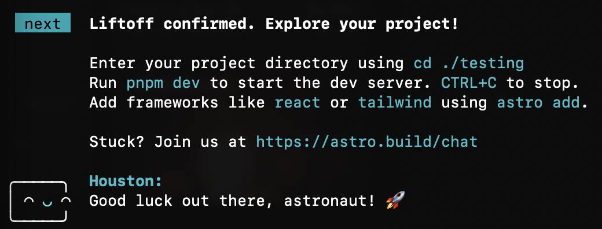
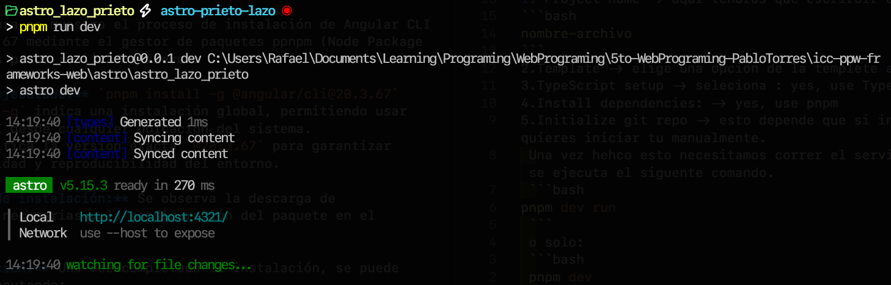

# Astro Starter Kit: Basics

```sh
pnpm create astro@latest -- --template basics
```

> 🧑‍🚀 **Seasoned astronaut?** Delete this file. Have fun!

## 🚀 Project Structure

Inside of your Astro project, you'll see the following folders and files:

```text
/
├── public/
│   └── favicon.svg
├── src
│   ├── assets
│   │   └── astro.svg
│   ├── components
│   │   └── Welcome.astro
│   ├── layouts
│   │   └── Layout.astro
│   └── pages
│       └── index.astro
└── package.json
```

To learn more about the folder structure of an Astro project, refer to [our guide on project structure](https://docs.astro.build/en/basics/project-structure/).

## 🧞 Commands

All commands are run from the root of the project, from a terminal:

| Command                   | Action                                           |
| :------------------------ | :----------------------------------------------- |
| `pnpm install`             | Installs dependencies                            |
| `pnpm dev`             | Starts local dev server at `localhost:4321`      |
| `pnpm build`           | Build your production site to `./dist/`          |
| `pnpm preview`         | Preview your build locally, before deploying     |
| `pnpm astro ...`       | Run CLI commands like `astro add`, `astro check` |
| `pnpm astro -- --help` | Get help using the Astro CLI                     |

## 👀 Want to learn more?

Feel free to check [our documentation](https://docs.astro.build) or jump into our [Discord server](https://astro.build/chat).

# Programación y Plataformas Web

# Frameworks Web: Astro

<div align="center">
  
</div>

## Practica 1: Instalación y Configuración de Astro

### Autores

**Rafael Prieto**
📧 pprietos@est.ups.edu.ec
💻 GitHub: [Raet0](https://github.com/Raet0)

**Adrian Lazo**
📧 blazoc@est.ups.edu.ec
💻 GitHub: [scomygod](https://github.com/scomygod)

### Introducción

En clase hemos aprendido Angular, un framework muy potente para crear aplicaciones web interactivas de una sola página (SPA). Paralelamente, estamos explorando Astro por nuestra cuenta, un framework moderno enfocado en la construcción de sitios web rápidos y optimizados para contenido, con un enfoque de **Island Architecture** que permite cargar interactividad solo donde es necesaria.

A continuación, presentamos una comparación resumida entre Angular y Astro:

| Característica        | Angular (SPA Framework)                                           | Astro (Island Architecture)                                                |
|-----------------------|-----------------------------------------------------------------|---------------------------------------------------------------------------|
| Propósito             | Aplicaciones Interactivas de Una Sola Página (SPA)              | Sitios Web enfocados en Contenido (SSG/SSR) con interactividad selectiva  |
| Renderizado Predeterminado | CSR (Client-Side Rendering). Gran carga de JavaScript inicial | SSG/SSR. Envía HTML puro (Zero JavaScript por defecto)                    |
| Archivos TypeScript   | La lógica TS (ej. Signals) se ejecuta en el cliente para la interactividad | La lógica TS entre --- se ejecuta sólo en el servidor (o en compilación). La interactividad requiere componentes de UI (client:) |

### Instalación de Astro CLI

Antes de iniciar, es necesario verificar que tenemos **pnpm** instalado.
Para verificarlo:

'''bash
pnpm -v
'''

si dice que no existe el comando, instálalo ejecutando:

```bash
npm install -g pnpm
```
---

### Creación de un Proyecto en Astro 

Primero ubícate en la carpeta donde quieras trabajar y vamos a ejecutar el siguente comando:
```bash
pnpm create astro@latest
```
Esto iniciará el asistente interactivo
1. **dir**, Project name -> aquí tendras que especificar el nombre del proyecto

`nombre-archivo`

2. **tmpl**, Template -> elige una opción, será la plantilla que quieras usar en el proyecto
3. **ts** TypeScript setup -> seleciona : yes, probablemente esta opción no aparezca porque ya tenemos **ts** instalado
4. **deps**, Install dependencies: -> yes
5. **git**, Initialize git repo -> esto depende que si inicializa ahi o lo quieres iniciar tu manualmente.
---
<div align="center">

</div>
 
Una vez hecho esto, necesitamos correr el servidor, para lograr esto se ejecuta el siguente comando:
 ```bash
pnpm dev run
 ```
 o solo:
 ```bash
 pnpm dev
 ```

<div align="center">
  
</div>

---

### Visualización del proyecto en el navegador

Una vez iniciado el servidor, podemos acceder a la aplicación desde el navegador ingresando a la dirección:

**http://localhost:4321/**

Aquí podremos ver la interfaz inicial del proyecto recién creado con Astro.

<div align="center">
  
</div>

